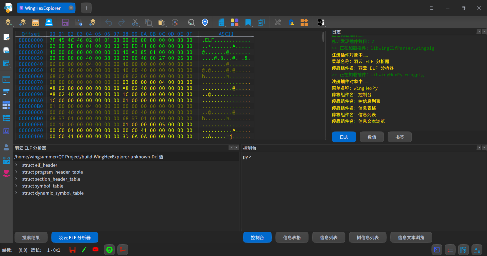
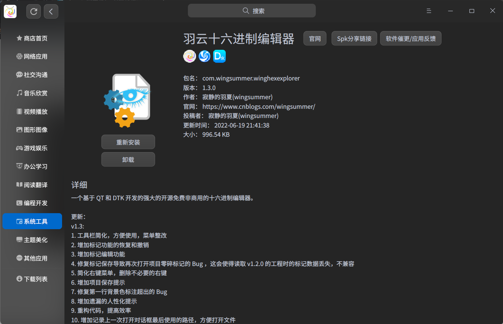

<h1 align="center"> WingSummer.WingHexExplorer</h1>

羽云十六进制浏览器

* 开源不易，给个 [Star](https://gitee.com/wingsummer/be.-windows.-forms.-hex-box/star) 或者 [捐助](#捐助) 吧

## 鸣谢

&emsp;&emsp;在此之前鸣谢大家的支持和帮助，如下是参与贡献和进行打赏捐助的同志：

|昵称|方式|备注|
|:--:|:--:|:--:|
|神末shenmo|打赏捐助|Deepin 论坛|
|lv36|打赏捐助|Deepin 论坛|

## 代码贡献者

&emsp;&emsp;维护一个好用的工具并不是一个人能做到了，更重要的是大家共同维护，如下是对本仓库代码有贡献的同志，特此感谢：

|昵称|贡献|
|:--:|:--:|
|神末shenmo|修复 ubuntu 下的显示问题|

## WingHexExplorer

&emsp;&emsp;本软件是基于 QT 编写的十六进制编辑器，采用 C++ 进行开发，目的是让 Deepin 上具有强大而免费的十六进制编辑器。目前只有 010 Editor 具有强大的十六进制编辑功能，但它是商用的。关注我开发动态的应该知道我开发了在 Windows 上用 C# 开发的`WingSummer.WingCloudHexExplorer`，目的是方便专业人士修改分析 PE 文件，并可作为学习 PE 结构的重要辅助工具。该项目具有 31 个 Star 和 9 个 Fork ，我也不打算维护了，因为我主力系统不是 Windows ，也没有充分的资金支持，全是本人的一腔热血和一厢情愿。没有任何人参与该仓库任何形式的贡献，这或许就是在中国个人搞开源的现状吧。

&emsp;&emsp;本项目从 2022/5/30 开始筹备，直到今天 2022/6/8 ，第一个开源可用的版本终于完成了，但还是有很多需要待完善的地方。2022/6/10 竣工了，插件系统已完全完成，测试了驱动器打开测试，虽然有点卡（我的测试是打开 600GB 的分区，虽然不到 1S ，但肉眼可见的短暂性卡顿）。

&emsp;&emsp;最近几天我大概率没多少时间维护该项目，希望大家指出要改进的地方的同时，最好贡献一下代码或者给出参考示例，以便我快速完善。要不然你提出一个看似简单的功能，其实需要大量的代码进行实现，这或许是“产品经理”和“程序员”之间的矛盾所在。提建议的时候不要天马行空，注意本软件只提供最基本的十六进制编辑和浏览服务，比如 010 Editor 里面的模版和脚本等服务，还需大家一起通过插件来实现！希望大家不要只提需求，更要提出建设性建议和解决方案，共同维护开源社区。具体详情将会在后面进行介绍。

### 软件架构

* TestPlugin : 虽然名字表面意思是测试插件，但它是编写该软件支持的插件一个非常重要的教程，重要性不可忽略。
* WingHexExplorer : 主程序，具有最基本的编辑十六进制编辑的能力，支持强大的插件系统，提供 GUI 交互。
* QHexView : 本软件十六进制编辑器的基础组件，仓库维护者`Dax89`，具体详情将在后面介绍。
* QHexEdit2 : 本软件打开超大文件模块相关代码，原打算使用该组件作为基础组件，但 Bug 多的我改不过来了，故弃用，保留了我所需关键代码，仓库维护者`Simsys`，具体详情将在后面介绍。

### 使用声明

1. 开发本软件目的是让 Deepin 上具有强大而免费的十六进制编辑器，同时也便于本人巩固或者学习 QT Linux 相关编程的知识。
2. 本软件仅供学习交流使用，不得私自用于商业用途。如需将本软件某些部分用于商业用途，必须找我购买商业授权，价格私聊。
3. 本人学生，由于本软件是用我的业余时间编写，不能及时修复 Bug 或者提供技术支持，请见谅。
4. 本人非计算机专业，编写程序难免有 Bug ，欢迎提交 PR 。

### 参与贡献

1. 如果您有想参与本软件代码开发递交，请在 pull request 联系我。
2. 本项目支持捐助，如有意愿请到本仓库通过微信或者支付宝的方式进行，一瓶水的价钱足以提高我的维护该项目的热情，感谢大家的支持。
3. 如果您想提交修复或者增进程序的代码，请在 pull request 递交。
4. 任何成功参与代码 Bug 修复以及增进程序功能的同志和 Sponsor ，都会在本仓库 ReadMe 和附属说明文件中体现，您如果是其中之一，本人可以按照您合理的意愿来进行说明。
  

**加入我们并不意味着就是代码的维护，你可以选择下列一项或多项进行参与：**

1. 代码维护：实现新功能或修复 BUG ，对代码进行维护和升级。
2. 文档编辑：主要是接口文档和教程需要撰写编辑，这很重要。
3. 参与讨论：主要是讨论本项目未来发展和方向等。
4. 编写插件：一起增强该软件的功能。

### 协议

&emsp;&emsp;本软件如果用于非商业用途，采用`WingSummer OpenSource Lincense`协议，对应的协议内容在仓库`OpenSource-LICENSE`文件。 **没有我的任何授权，不得将该软件用于任何形式的商业用途，包括我改良的部分，除非你直接使用原组件，不限于商业二次开发、换 UI 套壳、二手转卖等，我不允许任何人随意把我当作免费劳动力作为赚钱的工具！** 我的初衷是让 Linux 的生态更加完整，早日让祖国推动操作系统国产化。我不希望“吸血鬼”们利益归自己，脏活累活给开源，都那么理所当然，开源就是这么被败坏的。我不希望因为版权的事情牵扯了大量的精力。本人初次深入接触开源协议，不太会根据自己真正的需要来选择合适的协议，感谢`Deepin`前辈`BLumia`给我提供相关的建议和指导。由于本人一直在`README`一直强调商业用途相关事宜，本开源协议和我强调的内容相一致，故适用于目前所有本仓库的代码及其`fork`分支以及所有发行版。

&emsp;&emsp;如果你想将本软件或者本软件的部分代码用于商业用途，必须亲自咨询我，商讨商业授权相关事宜。如果得到授权则采用`WingSummer Commerical License`协议，也就是本仓库的`Commerical-LICENSE`文件的内容。

### issue 前必读

&emsp;&emsp;如果你有任何形式的建议，在提交 issue 之前，请一定要阅读下面的声明，以免浪费我们双方宝贵的时间：

1. 本人不考虑兼容 Windows 系统，虽然 QT 是跨平台的，但有些代码是依赖特定平台的，且十六进制编辑组件在 Windows 上会有一些已知问题，本人没有时间也没有义务来搞跨平台的东西。
2. 本人不考虑多语言支持，主要是没时间和资金。由于本人是中国人，本人不考虑其他语言使用者。但如果使用其他语言，如果你有语言包，只需要简单的替换文件即可。
3. 本人不考虑除 deb 二进制安装包的分发，没时间和精力搞额外的东西。
4. 本人不考虑其他插件的开发，如果插件有使用问题，请联系开发者（不排除我会开发一些插件，这样可以直接联系我）。
5. 本人不考虑主题 UI 层面的问题，开发软件一切采用 DTK 原生样式，觉得丑找官方，或者自己写个样式编译加载。
6. 图标在暗黑模式下可能会有点丑，不太明显，我美工不好，希望有同志能够提供一套图标（不要有版权纷争的图标），PR 给我进行审核采纳。但如果你没有，就不要给我提。
7. 本人仅仅考虑适配 Deepin 系统，虽然 Deepin 是目前基于 Debian ，基本所有的 Debian 甚至其他 Linux 系统理论上也可以用，但不排除有问题，如果出问题，我也不会进行修复。

&emsp;&emsp;上面一切的一切，如果你是志同道合的开源贡献者，欢迎 fork 我的仓库进行相应的维护！

&emsp;&emsp;如果出现比较严重的 Bug ，本人也可能不会及时的响应，目前我面临大学毕业的难题，顶着未来未知的压力和艰难的就业和研究生大军现状，谢绝站在道德的制高点不嫌冷的指指点点。

### 有关 QHexView

&emsp;&emsp;本软件基于`QHexView`作为十六进制编辑器为基础进行开发，本人在改组件基础上添加新功能和进行代码的深度定制。如下是原仓库的必要说明，详情请点击 [此链接](https://github.com/Dax89/QHexView/tree/master) ：

---

QHexView
========
QHexView is a hexadecimal widget for Qt5
    
Features
-----
- Customizable data backend (see more below).
- Document/View based.
- Unlimited Undo/Redo.
- Fully Customizable.
- Fast rendering.
- Easy to Use.

Buffer Backends
-----
These are the available buffer backends:
- QMemoryBuffer: A simple, flat memory array.
- QMemoryRefBuffer: QHexView just display the referenced data, editing is disabled.

It's also possible to create new data backends from scratch.

License
-----
QHexEdit is released under MIT license

---

&emsp;&emsp;本人对改组件的改进如下：

1. 增加有关描述文件状态相关的功能：指示是否被修改、是否具有可写权限、是否锁定文件以防修改、是否可以增改字节数
2. 增加可隐藏地址蓝栏和 ASCII 解码字符栏以及表头的功能
3. 实现超大文件（超出2GB）读写功能模块（原组件并未实现此功能）
4. 修改地址显示长度，以适应地址的使用习惯
5. 简化编码方式，删除一些冗余代码
6. 增加更多的信号，充分控制 QHexView 组件
7. 增加书签使用和管理功能
8. 修复滚动条有关内容完全仍能够显示但仍滚动内容的 Bug
9. 修复粘贴指针闪动位置保持不变问题，修改粘贴限制策略
10. 增加一些接口适应工作区支持需要
11. 修复标记背景色第一行有超出部分的 Bug

### 有关 QHexEdit2

&emsp;&emsp;起初我打算使用`QHexEdit2`作为十六进制编辑器为基础进行开发，该组件虽然轻松打开超大文件，但是它的编辑功能能用是能用，但有很多大大小小的 Bug ，我还逐一修了修，但发现仅仅我的力量和时间是杯水车薪。然后我找到了`QHexView`，也就是上面所属的组件，但它有一个致命的缺陷，无法打开超大文件，被我 Pass 掉了，后来我尝试用了它，发现开发者在开发改组件是下了足够大的功夫的，编辑十分流畅。最近看到`QHexView`贡献者们想搞一个`QHexView 5.0`，对代码进行了重构，但并没有实现任何功能，差不多是个空空的框架，不过从接口看出更强大的易用性，这个是原组件所不具有的，这花费我比较多的时间来阅读源代码，并向外扩展接口以适应我的开发需求。

&emsp;&emsp;然后我想，既然`QHexEdit2`具有强大的打开文件的能力，而`QHexView`不具备，但它具有强大的编辑界面，于是乎，我移植`QHexEdit2`的打开超大文件的代码到`QHexView`当中，并做好了适配和功能增强。原仓库的链接： https://github.com/Simsys/qhexedit2 ，它的协议如下：

Copyright (C) 2015-2016 Winfried Simon

This software may be used under the terms of the GNU Lesser General 
Public License version 2.1 as published by the Free Software Foundation 
and appearing in the file license.txt included in the packaging of this file.

This program is distributed in the hope that it will be useful,
but WITHOUT ANY WARRANTY; without even the implied warranty of
MERCHANTABILITY or FITNESS FOR A PARTICULAR PURPOSE. See the
GNU Lesser General Public License for more details.

You should have received a copy of the GNU General Public License
along with this program.  If not, see <http://www.gnu.org/licenses/>.

## 效果图

羽云十六进制浏览器

## 捐助

**
您的每一份支持都将是本项目推进的强大动力，十分感谢您的支持
**

感谢支持

感谢支持

## 鸣谢

&emsp;&emsp;此程序的完成基本是我现学现卖，因为 QT 在此之前我虽然学过，但几乎没有写过一个完整的项目。DTK 也是我新接触的，但总的说来，文档还是有点差劲，一点都不全，不过，官方开源了文本编辑器的源码，我对此对我感兴趣需要实现的代码进行了研读，实现了我想要的功能，在此感谢。如果没有该项目，我无法独自完成这个项目。里面有一些地方会有深度文本编辑器的影子，这在所难免，因为这个是我学习在借鉴使用魔改形成的代码，比如单例且传参的实现、DTK 设置对话框的使用以及国际化，跳转条的样式和代码结构。

## 有关仓库

&emsp;&emsp;最近发现了一个仓库，十分简洁，还允许免登录下载发行版。对于仅仅我来维护该软件仓库足够了。以后 Gitee 仅作为备份使用，故关闭了它的 issue 、PR 、Wiki 功能，如果想贡献想法或者代码建议到 GitLink ： https://www.gitlink.org.cn/wingsummer/WingHexExplorer 。

&emsp;&emsp;如果想到 Gitea 看，请到： https://code.gitlink.org.cn/wingsummer/WingHexExplorer 。其实它就是 GitLink ，不过貌似 GitLink 显示仓库图片会有点 Bug ， **推荐到这里来！**

&emsp;&emsp;如果你还想到 Gitee 逛逛： https://gitee.com/wingsummer/wing-hex-explorer 。欢迎到我的新仓库来 star 或者反馈 Bug 以及贡献代码。

&emsp;&emsp;如果你还想到 Github 逛逛： https://github.com/Wing-summer/WingHexExplorer ，Github 仅作为备份使用，但考虑到国外的朋友，保留了 issue 、PR 功能，由于本人访问 Github 不太顺畅，所以照看的就相对比较少，敬请谅解。

&emsp;&emsp;If you want to visit Github :  https://github.com/Wing-summer/WingHexExplorer .GitHub is only used for backup, but considering foreign friends, it retains the issue and PR. Forgiving me taking little care of Github repositories because of poor network access to it.

## WIKI

&emsp;&emsp;如果想学习羽云十六进制编辑器的使用以及如何开发该软件的插件，请到该链接：https://code.gitlink.org.cn/wingsummer/WingHexExplorer/wiki/%E7%AE%80%E4%BB%8B ，同时也欢迎大家指出 Wiki 的错误以及贡献优质内容。

## 以后维护

&emsp;&emsp;以后我维护的就没那么勤快了，打算每月如果有更新发布一次发行版，如果没有就顺延。但修 Bug 肯定早于发行版发布，如果有能力请阅读我的 Wiki 自己编译替换使用。如果提供的捐助比较多的话，我会把精力放多一点。

## 应用商店

&emsp;&emsp;目前我已把安装包投递到星火商店，欢迎大家下载安装。

星火商店

&emsp;&emsp;Spk分享链接：spk://store/store/com.wingsummer.winghexexplorer
